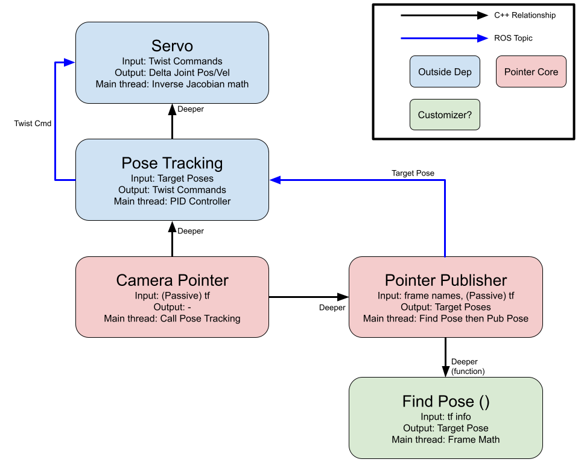

# ee_focus

This uses MoveIt Servo's pose tracking feature to continuously point a EE frame at a target frame (in the robot URDF)

Intended steps of use:
  1) Copy the launch file into your own project
  2) Modify the copied launch file to load the correct Servo parameters
  3) Determine the inputs to the `ee_focus` (frame names, loop rate, etc)
  4) Launch and pass input args (see below). Alternatively, set the defaults args in your modified launch file to match your values


## Launching
To launch from the command line:
```sh
roslaunch ee_focus ee_focus.launch ee_frame_name:=EEF gravity_frame_name:=GRAVITY target_frame_name:=TARGET loop_rate:=LOOP_RATE
```

To launch from another launch file:
```sh
<include file="$(find PACKAGE)/launch/ee_focus.launch">
    <arg name="ee_frame_name" value="EEF"/>
    <arg name="gravity_frame_name" value="GRAVITY"/>
    <arg name="target_frame_name" value="TARGET"/>
    <arg name="loop_rate" value="LOOP_RATE"/>
    <arg name="rotational_tolerance" value="0.05"/>
</include>
```

## Threading in this package
The package must do a few things in parallel:
  - Do all the math for figuring out the pose required to point the EE correctly (and publish the result)
  - Run the pose tracking of MoveIt Servo - math for converting a pose to a velocity command
  - Manage the I/O from ROS service callbacks
  - Run MoveIt Servo (in the background, not managed here)

There are 3 big objects/classes associated with these tasks:
  1) MoveIt Servo Pose Tracking (not implemented here, just used)
  2) `ee_focus_publisher` - relatively small class doing transform math, using `look_at_pose` service, and publishing target poses for MoveIt Servo Pose Tracking to move to
  3) `ee_focus` - manages starting/stopping the Pose Tracking via ROS service, reading parameters, initializing things, etc

The main thread of the executable will eventually be stuck in `EEFocus::spin()`, which is managing the MoveIt Servo Pose Tracking object. Starting/stopping tracking is handled via service callbacks with `EEFocus::startPointingCB` and `EEFocus::stopPointingCB`. The `EEFocusPublisher` object holds and manages its own thread where its math/publishing work will take place. Thus, when `EEFocus` tells `EEFocusPublisher` to start, the call returns instantly but kicks off a new thread with math/publishing work being done inside `EEFocusPublisher`

## Structure Overview


