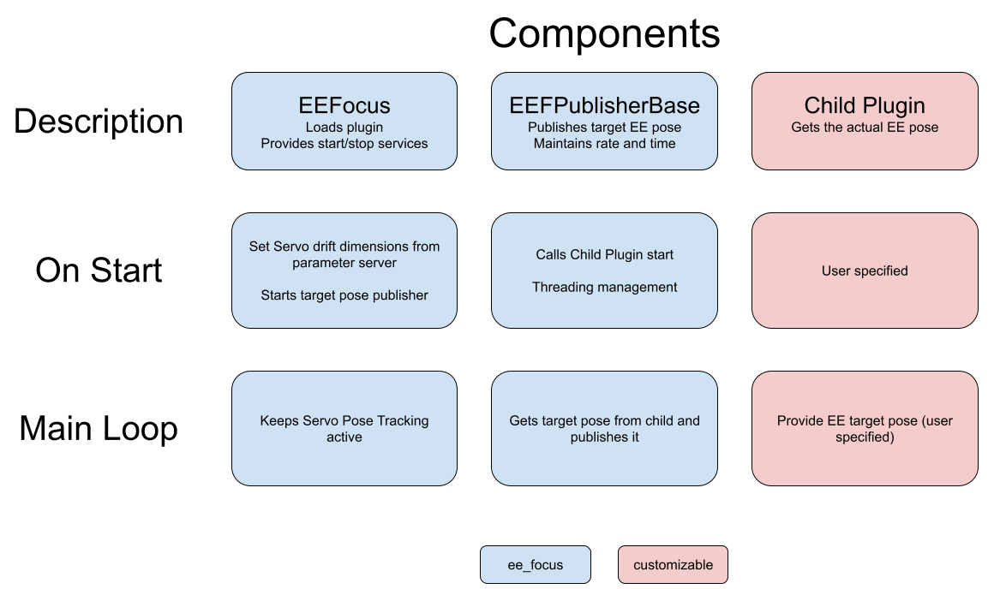

# ee_focus

# Overview
- [Installation](#Installation)
- [EE Pose Customization](#EE-Pose-Customization)

This uses MoveIt Servo's pose tracking feature to continuously point a EE frame at a target frame (in the robot URDF).

The package is implemented as a [pluginlib](http://wiki.ros.org/pluginlib) plugin, allowing a degree of customization of the pose of the EE frame. Included in the package are ready-made plugins:

1) `UnconstrainedCameraPointer`: calculates the rotation required to point the EE at the target frame and completes it without controlling the EE XYZ position. This results in the EE moving or drifting as it points towards target, but reduces the impacts of kinematic singularities. 

See the [EE Pose Customization](#EE-Pose-Customization) section for more detailed instructions on how to customize this package.


# Installation
`ee_focus` heavily relies on [MoveIt Servo](https://github.com/ros-planning/moveit/tree/master/moveit_ros/moveit_servo), which is still under constant development. You might consider [installing MoveIt from source](https://moveit.ros.org/install/source/) to have the most current Servo version.

To get and build the required code, run:
```sh
git clone https://github.com/UTNuclearRoboticsPublic/ee_focus.git
git clone https://github.com/UTNuclearRoboticsPublic/look_at_pose.git
rosdep install --from-paths . --ignore-src -y
catkin build
```

Don't forget to re-source your workspace after building the packages.

## Demonstration
For a minimial demonstration on a simulated UR5, we need one more package:
```sh
git clone https://github.com/ros-industrial/universal_robot.git
rosdep install --from-paths . --ignore-src -y
catkin build
```

Source the workspace, and in 3 seperate terminals, run:
```sh
roslaunch ee_focus ee_focus_simulation.launch
```
Wait for RViz to come up before continuing with the other commands. If this first `roslaunch` doesn't spawn the robot in a "bent elbow" configuration, end it and try again. Sometimes the first time takes a bit too long and it misses the configuration loading.

```sh
rosrun ee_focus dynamic_tf.py /world /demo_frame
```
After this you should be able to use number keys to move the target frame around. We reccomend added `tf` to your RViz configuration to see it.

```sh
rosservice call /ee_focus/start_ee_focus
```
This call should move the arm to point the EE at the `/demo_frame` from above. If you move the frame while tracking, the EE should following along with it.

# EE Pose Customization

`ee_focus` handles the interface with MoveIt Servo's `PoseTracking`, which needs a target pose as an input. The calculation of this pose is customizable via plugins. You might want to maintain a specified distance, viewing angle, or something else entirely use-case specific. The below diagram is a high level overview of the components of `ee_focus`, including the customizable part.



## Writing your custom pose calculator
To write your own plugin, you will need to inherit from `ee_focus::EEFPublisherBase`. Your child class will need to interact in some required ways:

1) Have an empty constructor that takes no args. This is a pluginlib requirement
2) Implement the pure virtual `EEFPublisherBase::poseCalculation` function. This is where your code will actually provide the `PoseStamped` message to publish
3) Export your class with `PLUGINLIB_EXPORT_CLASS`

The `ee_focus::EEFPublisherBase` class also includes empty virtual functions that may be implemented in your plugin for easy customization. These include:

1) `initialize_child()` which allows child-specific initialization to be run, and happens at the end of `EEFPublisherBase` initialization
2) `start_child()` allows child code to run as tracking is started, and is run right before `EEFPublisherBase` starts its publishing
3) `stop_child()` allows child code to run as tracking is stopped, and is run right before `EEFPublisherBase` stops sending Pose messages
